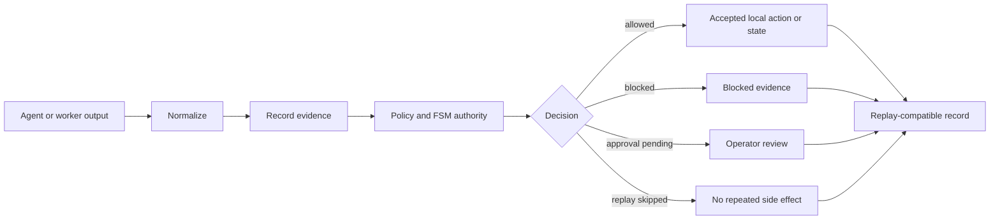

# Quant-M

<p align="center">
  
</p>

<p align="center">
  <strong>Local-first Rust control plane and flight recorder for governed AI work.</strong>
</p>

<p align="center">
  Agents generate. Quant-M records, gates, replays, and continues.
</p>

Quant-M turns agent activity into a local, inspectable record: what happened, what evidence supported it, which actions were blocked, what the run cost, and whether another model or session can continue safely.

It is not another chatbot or autonomous agent platform. It is the governance layer around the tools you already use.

> **`v0.1.0-alpha`** Public developer preview. CLI-first, local-first, intentionally conservative, and not a production trading system.

[Start](#start-in-one-minute) · [Features](#what-quant-m-does) · [Agent Cluster](#agent-cluster) · [Council](#adaptive-council-shadow-router) · [Story](#why-quant-m-exists) · [Screenshots](#onboarding-preview) · [Status](#safety-and-maturity) · [Docs](#documentation)

## Start In One Minute

Quant-M starts with one command and asks what role this device should play.

### Prepare A Source-Build Device

Debian-style Linux, Raspberry Pi, laptop, or desktop:

```bash
sudo apt-get update
sudo apt-get install -y git curl cargo openssh-client
```

Android with Termux, when used as a lightweight child:

```bash
pkg update
pkg install curl openssh termux-api
```

Old Android children should not need Git or Cargo in the normal product flow. Source builds on those devices are a development fallback.

### Clone And Start

```bash
git clone https://github.com/web5labs/Quant-M.git
cd Quant-M
./quantm
```

On first run, onboarding creates safe local configuration and routes the device to the correct next surface. Select **option 3** for Codex CLI. Quant-M opens active chat only when the chosen CLI or configured model route is actually usable; otherwise it stops with a concrete setup command.

Codex chat starts with full write access inside the current project only. Quant-M uses Codex `workspace-write`, anchors execution to the canonical project root, and rejects writable paths outside it.

## Choose A Role

Roles follow capability rather than hardware labels.

| Role | Best for |
| --- | --- |
| Solo local node | One computer running governed local agent work |
| Agent Cluster core | The trusted device that owns approval and canonical state |
| Agent Cluster child | Observe-only evidence work on another local device |
| Staff-OS worker | Bounded worker handoffs into a larger local workspace |
| Server/VPS node | Headless or remotely operated Quant-M runtime |

A phone can be a core when capable. A laptop can be a child. A Raspberry Pi can be either.

## What Quant-M Does

| Surface | Purpose |
| --- | --- |
| Evidence and replay | Preserve runs and re-check them without repeating side effects |
| Authority gates | Separate proposals, approvals, blocked actions, and accepted state |
| Context continuity | Turn long sessions into compact, inspectable continuation packets |
| Agent Cluster | Pair local devices while keeping children observe-only |
| Adaptive Council | Evaluate candidate and audit packets through deterministic shadow policy |
| Cost ledger | Record provider-path and dry-run cost evidence locally |
| Capability truth | Label features as wired, guarded, dry-run, mock, or unavailable |
| Role-first onboarding | Configure devices without assuming every node should open chat |
| Governed chat TUI | Use a ready Codex CLI or configured model route with visible scope and evidence state |

Quant-M does **not** currently provide live trading, broker execution, automatic proposal approval, unchecked shell access, or child authority over canonical state.

## How It Works

Markdown explains why. Rust decides state. Replay proves what happened.



The central rule is simple: a model can suggest, a worker can propose, and a tool can be detected. None of those automatically becomes authority.

## Agent Cluster

Agent Cluster connects Quant-M roles over the same trusted local network, including Wi-Fi. It is designed to make useful, limited workers out of spare phones, tablets, Raspberry Pi boards, mini PCs, laptops, and servers.

On the core:

```bash
quant-m pair doctor
quant-m pair cockpit
quant-m device add --qr
```

On the child:

```bash
quant-m child join --url http://<core-local-ip>:8787/join/<invite_id>
```

The operator approves or denies the request on the core. Approved children remain observe-only: no provider calls, execution, approval authority, canonical writes, or financial execution.

Wi-Fi is supported; Ethernet and ADB are optional. Pairing URLs use real private interface addresses rather than `0.0.0.0` or loopback.

[Read the complete Agent Cluster guide](docs/agent-cluster.md), including Termux prerequisites, heartbeats, revocation, binary bootstrap, pack sync, and real-device validation.

## Adaptive Council Shadow Router

The Council router evaluates prepared candidate analysis and anonymous audit ballots without calling a model or embedding provider.

```bash
quant-m council policy
quant-m council shadow --input configs/council-shadow.example.json
```

It can recommend worker expansion, a blind critic, a full Borda audit, representative return, constrained editing, Chairman synthesis, or abstention. Evidence, lineage, conflict, claim coverage, and ballot validity are gates; semantic agreement never becomes a probability of truth.

Add `--json` for the complete decision or `--record` to persist bounded hashes and metadata under `workspace/state/council-shadow/`.

[Read the routing wiki](WikiSkill/wiki/index.md).

## Why Quant-M Exists

<p align="center">
  
</p>

Quant-M has two namesakes.

The water bear represents resilience under hostile conditions: stale context, interrupted sessions, failed tools, incomplete evidence, unsafe side effects, and handoffs between models.

The quant side represents disciplined decision systems. Quant-M began as a stress test for an AI-assisted quant-risk cluster: inexpensive edge devices acting as workers while a stronger Rust core retained evidence, policy, cost tracking, and finite-state authority.

Trading is not the alpha product. It was the proving ground. Forex, stocks, crypto arbitrage, Bitcoin accumulation, and prediction-style markets exposed the exact failures Quant-M is built to contain: noisy evidence, changing state, expensive mistakes, and pressure to confuse a plausible answer with an authorized action.

That origin explains the product today: agents may be creative, but authority must remain inspectable.

## Onboarding Preview

Onboarding covers workspace, role and device capability, network posture, optional model and CLI routes, operator channel, context continuity, and final review.

Detected tools or models remain disabled until configuration and policy allow them.

The chat TUI shows route readiness, project scope, sandbox mode, session count, and evidence state. A selected-but-missing CLI no longer opens an inert chat surface.

<table>
  <tr>
    <td width="50%">
      
    </td>
    <td width="50%">
      
    </td>
  </tr>
  <tr>
    <td width="50%">
      
    </td>
    <td width="50%">
      
    </td>
  </tr>
  <tr>
    <td width="50%">
      
    </td>
    <td width="50%">
      
    </td>
  </tr>
</table>

## Safety And Maturity

Quant-M is conservative by design:

- Workers propose; the governed core decides.
- Channels are not execution authority.
- Replay never repeats side effects.
- Provider, network, HTTP worker, Telegram, and shell paths remain gated.
- Children remain observe-only.
- Live trading and automatic approval remain disabled.

Current authority snapshot:

| Surface | Status |
| --- | --- |
| Worker jobs, skill execution, Context Guardian | Wired |
| Workflow cursor, approval policy, replay, worker proposals | Partially wired |
| Provider onboarding and multi-lane decision utilities | Audited or dry-run |
| Adaptive Council routing | Deterministic shadow mode |
| Child bootstrap and pack sync | Scaffolded |
| Live financial execution | Unavailable |

Still developing:

- packaged release binaries and installers
- broader fresh-device first-run verification
- launchd/systemd service documentation
- full child binary and pack activation flows
- worker federation and distributed state
- live provider-backed adaptive Council orchestration

## Validation

The repository is checked with:

```bash
cargo fmt --all -- --check
cargo test
cargo clippy --all-targets -- -D warnings
cargo build --release --quiet
```

Focused proof commands include:

```bash
quant-m capabilities --json
quant-m fsm authority --json
quant-m pair doctor
quant-m council shadow --input configs/council-shadow.example.json --json
```

## Documentation

| Guide | Use it for |
| --- | --- |
| [Agent Cluster](docs/agent-cluster.md) | Pairing, Termux, heartbeats, bootstrap, and pack sync |
| [Android deployment](deploy/android/README.md) | Phones, tablets, Termux, and mobile core/child roles |
| [Android node kit](android-node-kit/bundles/quant-m-edge-bundle/README.md) | Edge bundle contents and device preparation |
| [Council routing wiki](WikiSkill/wiki/index.md) | Source architecture, concepts, and implementation boundaries |
| [Codex chat adversarial review](docs/adversarial/codex-chat-hardening.md) | Stale-route findings, project sandbox contract, benchmarks, and implementation prompt |
| [Validation notes](docs/validation/) | Milestone-specific proof and limitations |

## Contributing

Contributions should preserve the local-first authority boundary: no hidden provider calls, implicit live execution, channel-as-authority, child auto-approval, or worker proposal auto-acceptance.

## License

MIT
