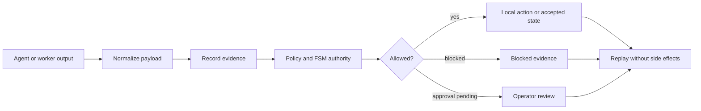
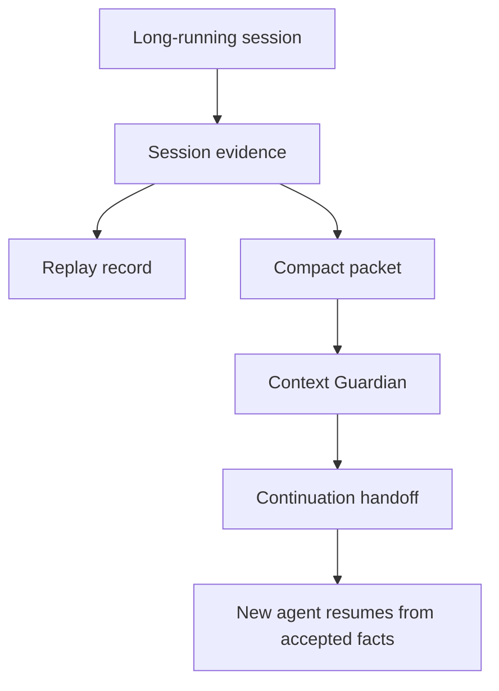

# Quant-M

<p align="center">
  
</p>

<p align="center">
  <strong>Local-first Rust control plane and flight recorder for governed AI work.</strong>
</p>

<p align="center">
  Evidence · replay · FSM authority · side-effect gates · context continuity · safe local defaults
</p>

Quant-M turns messy agent work into a local, inspectable record: what happened, what evidence supported it, what was blocked, what it cost, and whether another model or session can safely continue.

It began as a stress test for an AI-assisted quant-risk cluster: cheap edge devices acting as workers, a stronger Rust core coordinating them, and strict finite state machines deciding whether high-risk actions were even allowed. Trading is not the product. It is the proving ground that forced Quant-M to care about evidence, replay, policy, cost, state, and operator authority.

> `v0.1.0-alpha`: public developer preview. Local-first, CLI-first, intentionally conservative, and not a production trading system.

[Five-Minute Proof](#five-minute-proof) | [Story](#story) | [Runtime Model](#runtime-model) | [Authority Snapshot](#authority-snapshot) | [Safety](#safety-posture) | [Release Notes](docs/release/v0.1.0-alpha.md)

## Five-Minute Proof

Clone the repo:

```bash
git clone https://github.com/web5labs/Quant-M.git
cd Quant-M
```

For guided first-run setup, start onboarding:

```bash
./quantm onboard
```

For the local shell directly:

```bash
./quantm
```

Inside `quant-m>`, try:

```text
demo
doctor
help
exit
```

To chat through the Codex CLI from inside the shell, use `ask <question>` after Codex is installed and logged in:

```text
ask what should I inspect first?
```

Or run the proof loop directly:

```bash
./quantm consensus --dry-run "What should a new Quant-M user inspect first?"
```

Copy the printed `session_id`, then run:

```bash
./quantm replay <session_id>
./quantm compact <session_id>
./quantm context guard --json
./quantm cost summary
./quantm fsm authority
```

The first run is intentionally safe:

- no broker
- no live trading
- no hidden provider call
- no automatic shell execution
- no hosted service requirement
- no API key requirement

## Story

Quant-M has two namesakes.

**The water bear** represents resilience. Tardigrades survive pressure, radiation, dehydration, cold, heat, and space-like environments. Quant-M is built for the harsh parts of AI work: stale context, failed runs, drift, interrupted sessions, incomplete evidence, and handoffs between models.

**The quant** represents disciplined decision systems. The original concept was an AI hedge-fund-style cluster where old Wi-Fi-capable devices became small workers reporting to a stronger core machine. Each worker could research, propose, or monitor, but high-risk actions had to pass through explicit evidence, weighted checks, policy gates, and finite state machines.

The original benchmark desks were:

| Benchmark desk | Why it stresses the runtime |
| --- | --- |
| Forex | Multi-session markets, macro timing, risk discipline |
| Stocks | Market hours, news noise, portfolio context |
| Crypto arbitrage | Fragmented APIs, fast state changes, execution risk |
| Bitcoin DCA | Long-running accumulation, cost and schedule tracking |
| Prediction-style markets | Ambiguous signals, sentiment, and operator review |

Those desks are not the alpha product promise. They explain why Quant-M is strict. A system shaped by high-risk decision environments cannot treat chat text as authority, cannot let workers silently execute, and cannot replay side effects.

## Runtime Model

Markdown explains why. Rust decides state. Replay proves.



Quant-M is not trying to make agents more magical. It makes their work easier to inspect, replay, resume, and stop.



## What Quant-M Does

| Surface | Purpose |
| --- | --- |
| Evidence trail | Preserve what happened and where proof lives |
| Replay | Re-check a run without repeating side effects |
| Compact packets | Turn long sessions into small continuation files |
| Context Guardian | Emit typed continuation state and recommended action |
| Cost ledger | Inspect dry-run and provider-path costs locally |
| Capability truth | Distinguish shipped, guarded, dry-run, mock, experimental, design-only, external-required, unavailable, and deprecated surfaces |
| Side-effect policy gate | Normalize decisions such as `allowed`, `blocked`, `approval_pending`, `denied`, `unavailable`, `dry_run_only`, and `replay_skipped` |
| Workflow cursor FSM | Keep workflow execution ordered without pretending descriptor browsing is execution |

## Authority Snapshot

The Rust authority registry is the source of truth:

```bash
./quantm fsm authority
./quantm fsm authority --json
./quantm capabilities
./quantm capabilities --json
```

Current alpha snapshot:

| FSM | Status |
| --- | --- |
| `worker_job` | `wired` |
| `skill_execution` | `wired` |
| `context_guardian` | `wired` |
| `workflow_cursor` | `partially_wired` |
| `policy_approval` | `partially_wired` |
| `session_replay` | `partially_wired` |
| `worker_proposal` | `partially_wired` |
| `provider_tool_onboarding` | `audited_only` |
| `question_consensus_strategist` | `audited_only` |
| `shared_state_lifecycle` | `audited_only` |

`partially_wired` and `audited_only` are honest labels. Quant-M should not claim universal runtime authority where a surface is still inspection-only, locally validated, or documented rather than fully enforced.

## Safety Posture

Quant-M is conservative on purpose:

- Workers propose; the governed core decides.
- Channels are not execution authority.
- Replay does not repeat side effects.
- Shell-backed skills are blocked unless config and policy allow them.
- Provider, network, Telegram, webhook, HTTP worker, and shell paths stay gated.
- Live trading, broker execution, exchange execution, and auto-approval are not enabled.
- Detection does not equal permission: a model, CLI, tool, or channel can be present without being allowed.

This release is useful for evaluating the governance model, not for delegating unchecked autonomy.

## Onboarding Preview

Run guided setup when you want first-run questions instead of jumping straight into the shell:

```bash
./quantm onboard
```

For a throwaway demo config that will not touch your local setup:

```bash
./quantm --config /tmp/quant-m-demo.toml onboard
```

The flow covers workspace, device type, network posture, model provider, local model availability, developer tools, operator channel, continuity guard, and final review.

For the fuller colored HTML version, open [`docs/onboarding-mockup.html`](docs/onboarding-mockup.html).

## Where Quant-M Fits

Coding agents generate work. Agent harnesses coordinate tools and workers. Quant-M preserves evidence, replays decisions, normalizes payloads, tracks cost, and helps the next agent continue safely.

Codex, Claude Code, Gemini, OpenCode, Antigravity-style CLIs, OpenRouter, and local models are better understood as optional tools that can run beside Quant-M, not competitors to Quant-M.

## Validation

Local release validation for `v0.1.0-alpha` passed:

```bash
cargo fmt --all -- --check
cargo test
cargo clippy --all-targets -- -D warnings
cargo build --release --quiet
python3 scripts/lint_project_onboarding.py --target .
cargo run --quiet -- fsm authority --json
```

The `v0.1.0-alpha` release tag points at:

```text
720d68b5883da485365259e5417e0bb3bf413ea2
```

## Current Status

Status: **public developer preview / alpha**.

Still developing:

- packaged release binaries and installer scripts
- fresh Mac and Linux first-run verification from README only
- formal launchd/systemd autostart docs
- broader provider normalization
- worker federation
- distributed state
- shared-state lifecycle FSM

## Contributing

Contributions should preserve Quant-M's local-first boundary: no hidden provider calls, no implicit live execution, no channel-as-authority, no live trading, and no worker proposal auto-acceptance.

## License

MIT
