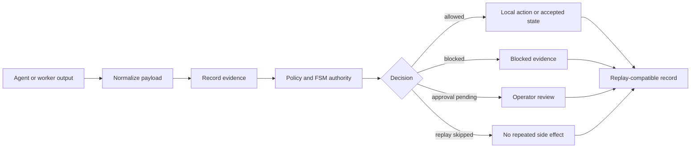
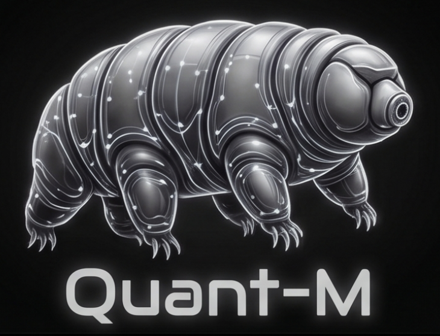
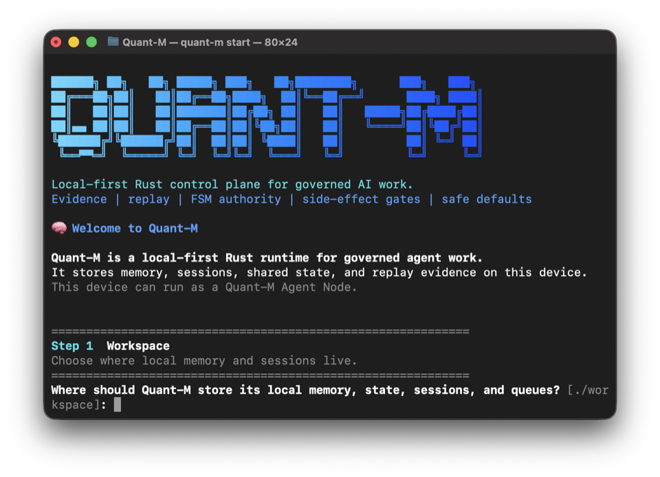
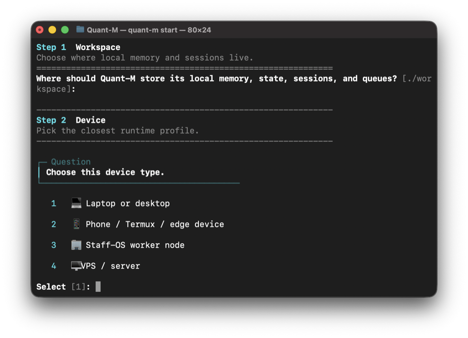
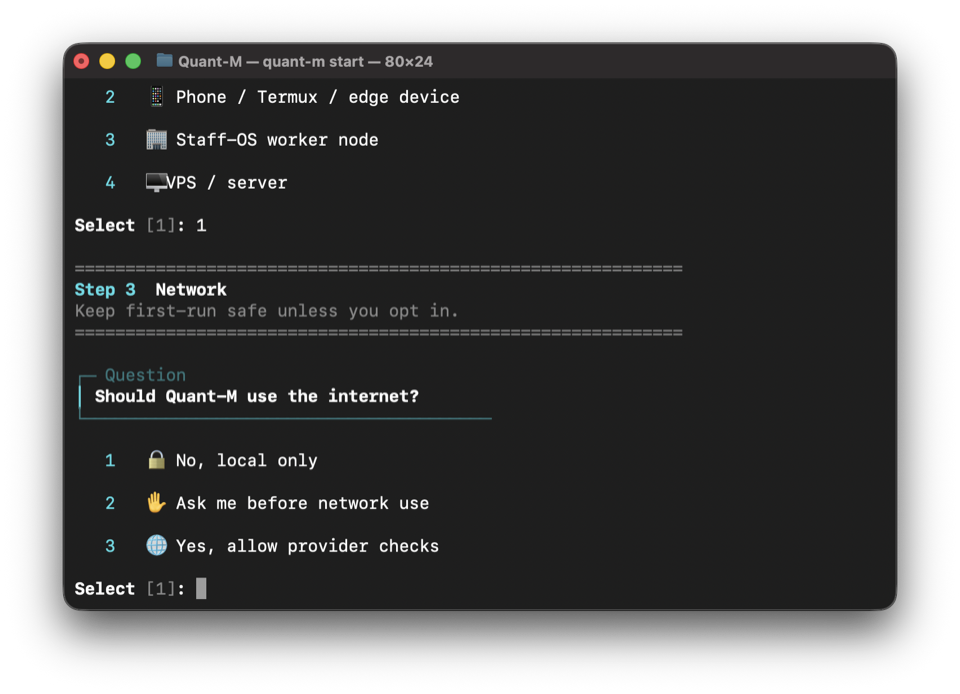
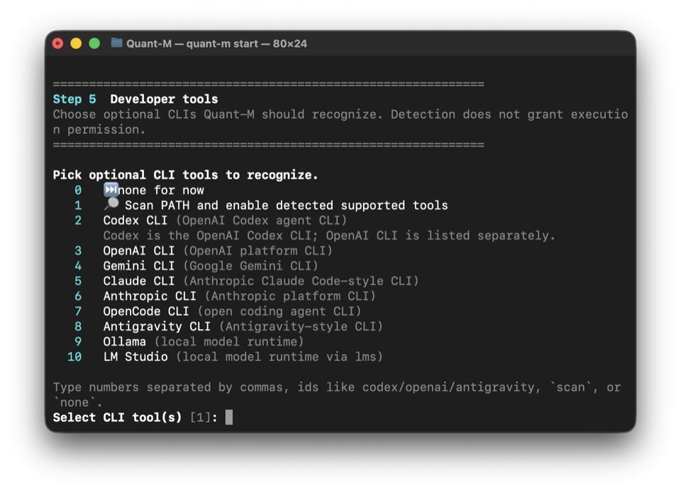
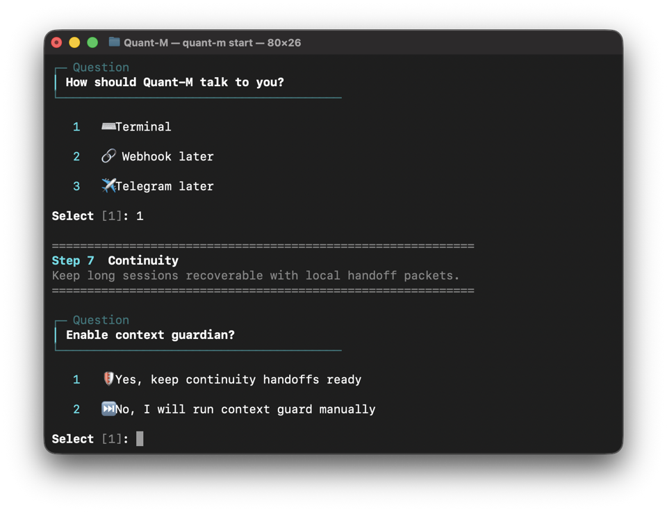
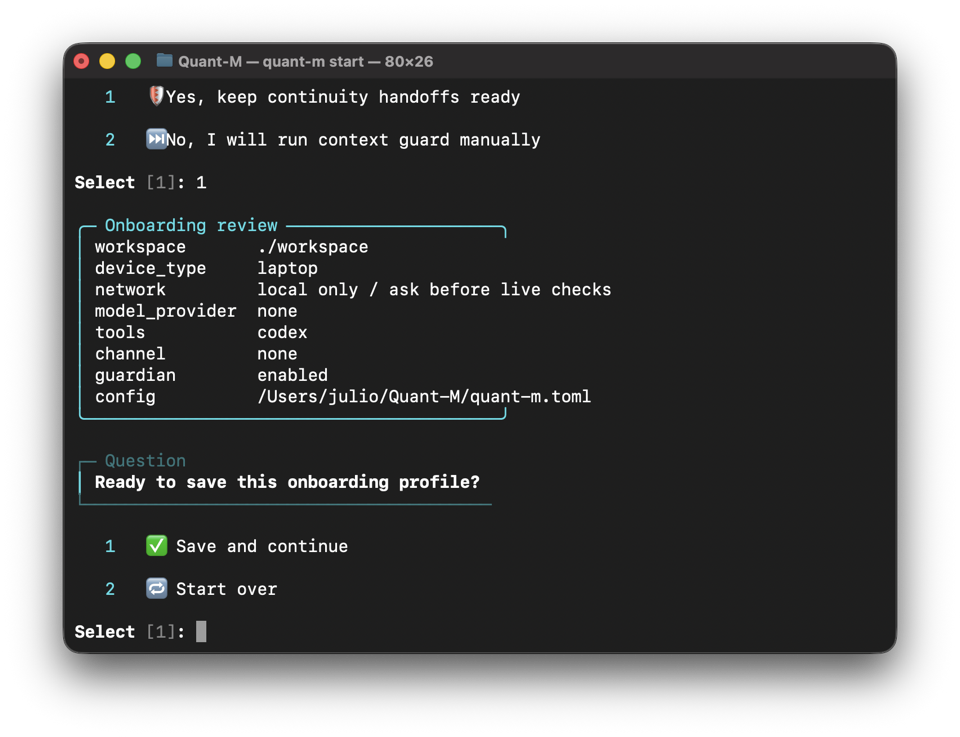

# Quant-M

<p align="center">
  
</p>

<p align="center">
  <strong>Local-first Rust control plane and flight recorder for governed AI work.</strong>
</p>

<p align="center">
  <strong>Agents generate. Quant-M records, gates, replays, and continues.</strong>
</p>

<p align="center">
  Evidence · replay · FSM authority · side-effect gates · context continuity · safe local defaults
</p>

Quant-M turns messy agent work into a local, inspectable record: what happened, what evidence supported it, what was blocked, what it cost, and whether another model or session can safely continue.

Quant-M is not a chatbot, broker, hosted agent platform, or trading bot. It is the local governance layer around AI-assisted work.

> `v0.1.0-alpha`: public developer preview. CLI-first, local-first, intentionally conservative, and not a production trading system.

[Start Here](#start-here) | [Agent Cluster](#agent-cluster) | [Safety](#safety-posture) | [Runtime Model](#runtime-model) | [Authority Snapshot](#authority-snapshot) | [Story](#origin-story) | [Validation](#validation)

## Start Here

Quant-M is easiest to understand as a local safety layer for agent work. Run it on one device first, then add other capable devices by role. Roles are capability-based, not hardware-biased: a weak tablet can be a child, a strong tablet can be a core, a laptop can be a child, and a Raspberry Pi can be a core.

Choose the role first:

- Solo local node
- Agent Cluster core
- Agent Cluster child worker
- Staff-OS worker
- Server/VPS node

Then choose the device class:

- laptop or desktop
- Raspberry Pi or mini PC
- Android phone or tablet with Termux
- Linux server
- other Linux-like device

### 1. Prepare The Device

Pick the one block that matches your device.

Laptop, desktop, or Raspberry Pi / Debian-style Linux:

```bash
sudo apt-get update
sudo apt-get install -y git curl cargo openssh-client
```

Android phone or tablet with Termux, minimal Wi-Fi node path:

```bash
pkg update
pkg install curl openssh termux-api
```

Termux:API is optional unless you want Android-specific device telemetry such as battery status. Install Termux and Termux add-ons from the same source when possible.

Git and Rust/Cargo on old child devices are development fallback tools only. On older or freshly reset Android devices, Termux package mirrors and TLS libraries can be out of sync, causing Git HTTPS failures such as `git-remote-https` aborts or `cannot locate symbol` errors. If that happens, update Termux packages, use `termux-change-repo`, and reinstall Git/curl/TLS packages. For normal Agent Cluster child use, the product direction is a core-hosted prebuilt `quant-m-child` binary over local Wi-Fi.

### 2. Get Quant-M

Do this on the device that will run the source checkout, such as a laptop, desktop, Raspberry Pi, server, or capable Termux device:

```bash
git clone https://github.com/web5labs/Quant-M.git
cd Quant-M
```

### 3. Run One Command

```bash
./quantm
```

That command opens onboarding on a fresh checkout. On small devices, onboarding writes the safe local config first and does not require the Rust core to be compiled before you answer the setup questions.

If this device will be the core, choose the core role during onboarding. If this device will be a child worker, choose the child role and let Quant-M print the next device-specific step.

## Agent Cluster

Agent Cluster is the local-alpha lane for running Quant-M across the same trusted local network, including Wi-Fi. It supports old, outdated, deprecated, or factory-reset Wi-Fi devices as safe child workers, and it also allows capable tablets, phones, Raspberry Pi boards, mini PCs, laptops, desktops, and servers to act as core nodes when they meet the core requirements.

The goal is role-first onboarding. A device can participate as a solo node, Agent Cluster core, observe-only child worker, Staff-OS worker, or server/VPS node. Old or limited devices should stay lightweight and observe-only. Stronger Wi-Fi-only devices may run the core for edge proof-of-concept deployments.

Good first use cases:

- old Android phone used as a Termux child node
- old Android tablet used as a watcher or observe-only worker
- newer Android phone or tablet used as a Termux core node
- Raspberry Pi used as a low-power always-on core or child node
- spare laptop or mini PC used as a stronger core or child worker
- factory-reset phone or tablet kept on local Wi-Fi for cluster experiments

Agent Cluster core requirements:

- ability to run the `quant-m` core binary
- local workspace/state storage
- enough disk and RAM to keep the core alive
- stable Wi-Fi or LAN; Ethernet is optional
- ability to bind local network ports
- shell/runtime access
- enough battery or power stability
- no public internet requirement
- no carrier/SIM requirement; Wi-Fi is enough

Safety rules:

- factory reset repurposed devices before use when practical
- keep them on trusted local Wi-Fi
- do not store API keys, broker credentials, or private tokens on child devices
- keep execution authority on the core node only
- keep child nodes observe-only by default
- do not expose the pairing server directly to the public internet
- do not use outdated child devices for live trading execution
- do not allow child nodes to approve work, mutate canonical shared state, or place orders

Real-device validation can be driven through ADB, manual Termux commands, SSH into Termux, a QR/bootstrap URL, a copied binary, or any other method that proves a real device executed the Quant-M command over the same Wi-Fi or local network. ADB is useful for provisioning and debugging Android devices, but it is not required for Agent Cluster validation.

What this local alpha can demonstrate:

- core CLI and `quant-m-child`
- QR/link child pairing with manual approval
- local pairing cockpit, invite registry, pending request list, approval, denial, and revoke flow
- child heartbeat visibility and revoke health blocking
- heartbeat visibility and device telemetry
- explicit observe-only leases
- echo evidence and scalar compute evidence
- Android node kit and deployment helpers for local-lab devices

What remains disabled:

- live trading and live betting
- broker, exchange, or sportsbook execution
- provider calls from children
- automatic proposal approval
- child canonical writes
- production remote orchestration

Milestones:

- `ONBOARDING_ROLE_ROUTER_AND_QR_PAIRING_P0B`: local Agent Cluster pairing cockpit, short-lived invite URLs, manual child approval, deny/revoke lifecycle, and observe-only safety flags.
- `CHILD_JOIN_REQUEST_P0C_A`: child-side manual URL join, stable child identity, and pending observe-only pair request submission. Heartbeat remains a later milestone.
- `CHILD_HEARTBEAT_REVOKE_P0C_B`: approved child heartbeat visibility, health summaries, stale/revoked classification, and heartbeat authority hardening.
- `WIFI_FIRST_PAIRING_URL_FIX`: Wi-Fi-first advertised pairing URLs, `pair doctor`, manual host/interface overrides, and Ethernet-optional wording.
- `MOBILE_TABLET_CORE_ROLE_17A_FIX`: role-first onboarding language, mobile/tablet core proof-of-concept guidance, and optional ADB validation language.
- `CHILD_BINARY_BOOTSTRAP_16A`: core-hosted child binary bootstrap so old Android/Termux child devices do not need GitHub clone, Cargo, Rust toolchains, or source builds during normal onboarding.

Pairing diagnostics:

```bash
quant-m pair doctor
```

`pair doctor` reports the selected bind address, the advertised child URL, real system interface names and local IPv4 candidates, ignored addresses, port availability, firewall guidance, and a child-side `curl` test command. Same trusted local network means the core and child are on the same Wi-Fi or LAN and can reach each other directly. Ethernet is optional; Raspberry Pi is supported but not required.

Pairing cockpit:

```bash
quant-m pair cockpit
```

Use the cockpit on the core to see the selected child-reachable URL, QR fallback text, detected addresses, pending request count, approved children, revoked children, and the safety boundary. Pairing is for the same trusted local network, including Wi-Fi. If the core binds `0.0.0.0:8787`, keep it on local Wi-Fi/LAN and do not expose the port to the public internet.

Create an invite for a nearby device:

```bash
quant-m device add --qr
```

If Quant-M cannot automatically choose the right Wi-Fi/local-network address, pass it manually:

```bash
quant-m pair cockpit --host 192.168.1.42
quant-m device add --qr --host 192.168.1.42
quant-m pair doctor --host 192.168.1.42
```

You may also select an exact interface name reported by `pair doctor`, such as `quant-m pair cockpit --interface en0`. Manual advertised hosts must be private IPv4 addresses. The server may bind `0.0.0.0`, but QR, join metadata, and child callback URLs use the same child-reachable host. Quant-M rejects mismatched explicit bind/host combinations and avoids `0.0.0.0`, `127.0.0.1`, and Docker/VM-style interfaces for phone/tablet QR URLs when a private Wi-Fi/LAN address is available.

The invite URL uses this shape:

```text
http://<core-wifi-or-lan-ip>:8787/join/<invite_id>
```

Child-side manual URL join:

```bash
quant-m child identity
quant-m child join --url http://<core-wifi-or-lan-ip>:8787/join/<invite_id>
```

Camera QR scanning is not required in this runtime. If a camera scanner is unavailable, paste the URL from the core into `quant-m child join --url <url>`. The child creates a local identity under its own workspace, stores no provider keys, requests observe-only authority, and remains pending until the operator approves it on the core. The current wired command surface is `quant-m child ...`; a separate `quant-m-child` binary remains part of the bootstrap/package path.

If terminal QR rendering is unavailable, Quant-M prints the local URL and manual fallback instead of failing. Watch pending requests from another terminal:

```bash
quant-m device add --watch
```

Approve, deny, list, or revoke children on the core:

```bash
quant-m child list
quant-m child approve <request_id>
quant-m child deny <request_id>
quant-m child revoke <node_id>
quant-m pair status --json
```

Manual approval is required. Approved children remain observe-only: no provider calls, no shell execution, no approval authority, no canonical shared-state writes, and no broker/exchange/sportsbook execution.

Approved children can report heartbeat visibility:

```bash
quant-m child heartbeat --core http://<core-wifi-or-lan-ip>:8787 --once
quant-m child list --json
quant-m pair status --json
```

Heartbeat proves visibility only. It does not grant provider calls, execution, approval authority, canonical writes, or broker/exchange/sportsbook execution. Revoked children are not counted as healthy or active. Real phone/tablet same-Wi-Fi/local-network proof is still a separate validation milestone.

Core-hosted child bootstrap:

```bash
quant-m bootstrap serve --bind 0.0.0.0:8788 --bundle-dir ./release-bundles --core-url http://<core-wifi-or-lan-ip>:8787
```

The bundle directory contains prebuilt `quant-m-child` files plus `.toml` metadata. The core lists only bundles whose metadata file size and SHA-256 match the local binary, then serves only those approved files. The bootstrap page/API shows platform, architecture, ABI, version, commit, file size, checksum, download URL, checksum verification command, `chmod +x`, and the manual pairing command.

Example child-side flow shown by the core:

```bash
pkg update
pkg install curl openssh termux-api
curl -fL -o quant-m-child http://<core-wifi-or-lan-ip>:8788/download/quant-m-child
printf '%s  %s\n' '<sha256>' quant-m-child | sha256sum -c -
chmod +x quant-m-child
./quant-m-child pair --core http://<core-wifi-or-lan-ip>:8787 --name android-tablet-01
```

Pairing still requires manual core approval. The child remains observe-only: no execution, approval, or canonical shared-state write authority is granted by bootstrap.

Next milestone, `CHILD_PACK_SYNC_17A`, gives approved children a Git-free way to receive playbooks and policy packs from the core:

```bash
quant-m pack serve --bind 0.0.0.0:8789 --pack-dir ./release-packs
```

Pack metadata lives next to each approved archive:

```toml
pack_id = "forex-worker-basic"
version = "0.1.0"
desk = "forex"
archive_name = "forex-worker-basic.tar"
archive_size = 12345
sha256 = "<sha256>"
created_at = "2026-06-30T00:00:00Z"
max_authority = "observe"
allowed_roles = ["forex_worker"]
schemas = ["evidence.schema.json"]
timing_policy = "timing.toml"
skills_manifest = "skills.manifest.json"
revoked = false
script_execution = false
```

The core lists only non-revoked packs whose archive size and SHA-256 match metadata, filters by role, and blocks arbitrary script execution. The child downloads the pack with `curl`, verifies SHA-256, caches it locally, reports the active pack hash in heartbeat, and includes the same hash in non-authoritative evidence.

`CHILD_PACK_SYNC_REAL_DEVICE_17B` is blocked until a real reachable device completes that child-side flow over the same Wi-Fi/local network. ADB returning no devices is only a debug detail; the blocker is that no real device completed download, checksum, cache, activation, heartbeat, and evidence reporting.

More device details:

- [Android deployment guide](deploy/android/README.md)
- [Android node bundle](android-node-kit/bundles/quant-m-edge-bundle/README.md)
- [Base runtime profile](android-node-kit/bundles/profiles/base-runtime/README.md)

## What Quant-M Is

Quant-M is a local Rust runtime for making AI-assisted work more inspectable, replayable, and governable. It is built for workflows where agent output alone is not enough.

A model can suggest, a worker can propose, a tool can be detected, and a channel can deliver a message. None of those things automatically become authority. Quant-M separates proposal from permission.

It helps answer:

- What did the agent do?
- Where is the evidence?
- Was a side effect allowed, blocked, or skipped?
- Can this session be replayed safely?
- Can another model continue from accepted facts?
- What did this cost?
- Which FSMs are actually wired, partially wired, or only audited?

## How Quant-M Is Different

Most AI tools focus on making agents do more. Quant-M focuses on making agent work safer to inspect, stop, replay, and continue.

| Compared with | Difference |
| --- | --- |
| ChatGPT or Claude | Chat tools answer questions. Quant-M records governed work, evidence, replay state, side-effect decisions, cost records, and continuation handoffs. |
| Codex, Claude Code, Gemini CLI, OpenCode | Coding agents generate and edit work. Quant-M gives them a local paper trail, policy boundary, replay path, and context continuation layer. |
| Agent harnesses | Harnesses coordinate tools and workers. Quant-M focuses on authority: evidence, proposals, allowed actions, blocked actions, replay, and safe continuation. |
| Trading bots | Quant-M came from a quant-risk cluster concept, but trading is not the alpha product. No live trading, broker execution, exchange execution, or auto-approval is enabled. |
| Logs | Logs tell you what happened. Quant-M aims to show what authority accepted, blocked, replayed, or continued. |

Use Quant-M when you want coding agents, worker agents, local models, or research workflows to leave behind evidence instead of terminal scrollback. Do not use it if you want a fully autonomous trading bot, a hosted SaaS agent platform, or unchecked tool execution.

## First Run

On a fresh checkout, the main command starts onboarding. After onboarding, Quant-M opens the next surface for the selected role instead of assuming every node should enter chat.

Solo local nodes may enter the governed chat cockpit only when the workspace is writable and a valid chat-capable model or CLI route is available. Agent Cluster core nodes receive pairing/setup instructions. Agent Cluster child workers receive join instructions. Staff-OS workers and Server/VPS nodes receive role-specific handoff or headless setup instructions. Chat can always be opened later with the explicit chat command when available.

Useful cockpit commands, when chat is explicitly opened, are `/help`, `/state`, `/cost`, `/ask`, and `/quit`.

To chat through the Codex CLI from inside Quant-M, install and log in to Codex first, then ask from the cockpit:

```text
/ask what should I inspect first?
```

For deeper CLI proof commands, use the validation checks below or the Android deployment docs.

The first run is intentionally safe:

- no broker
- no live trading
- no hidden provider call
- no automatic shell execution
- no hosted service requirement
- no API key requirement

## Expected Result

After first run, you should be able to inspect a session record, evidence index, replay result, compact continuation packet, Context Guardian output, cost summary, and FSM authority snapshot. The point is to show that Quant-M can preserve what happened, classify what was allowed, and prepare safer continuation state for the next session.

## Safety Posture

Quant-M is conservative on purpose:

- Workers propose; the governed core decides.
- Channels are not execution authority.
- Replay does not repeat side effects.
- Shell-backed skills are blocked unless config and policy allow them.
- Provider, network, Telegram, webhook, HTTP worker, and shell paths stay gated.
- Live trading, broker execution, exchange execution, and auto-approval are not enabled.
- Detection does not equal permission: a model, CLI, tool, or channel can be present without being allowed.

This release is useful for evaluating the governance model, not for delegating unchecked autonomy.

## What Quant-M Does Today

| Surface | What it means |
| --- | --- |
| Evidence trail | Preserves what happened and where proof lives |
| Replay | Re-checks a run without repeating side effects |
| Compact packets | Turns long sessions into small continuation artifacts |
| Context Guardian | Emits typed continuation state and recommended next action |
| Cost ledger | Shows dry-run and provider-path costs locally |
| Capability truth | Separates shipped, guarded, dry-run, mock, experimental, design-only, external-required, unavailable, and deprecated surfaces |
| Side-effect policy gate | Normalizes decisions like `allowed`, `blocked`, `approval_pending`, `denied`, `unavailable`, `dry_run_only`, and `replay_skipped` |
| Workflow cursor FSM | Keeps workflow progress ordered without pretending descriptor browsing is execution |

## Adaptive Council Shadow Router

Quant-M includes a provider-free shadow evaluator for adaptive Council policy. It validates prepared candidate analysis and anonymous audit ballots, then recommends one of these bounded actions: expand the worker panel, run a blind critic, expand to a full Borda quorum, return an unchanged reviewed representative, run a constrained editor, invoke Chairman synthesis, or abstain.

```bash
quant-m council policy
quant-m council shadow --input configs/council-shadow.example.json
quant-m council shadow --input configs/council-shadow.example.json --json
```

Add `--record` to persist a bounded decision record under `workspace/state/council-shadow/`. Records contain candidate hashes and decision metadata, not full candidate answers. The shadow router does not call models, providers, embeddings, tools, or execution APIs. Semantic agreement is recorded as an advisory signal and never overrides failed evidence, conflict, lineage, critic, or ballot gates.

The ingested architecture and Quant-M adaptation live in [WikiSkill/wiki/index.md](WikiSkill/wiki/index.md).

## Runtime Model

Markdown explains why. Rust decides state. Replay proves what happened.



Agent or worker output enters Quant-M as a proposal or evidence item. Quant-M normalizes the payload, records evidence, checks policy and FSM authority, then classifies the result as `allowed`, `blocked`, `approval_pending`, `denied`, `unavailable`, `dry_run_only`, or `replay_skipped`.

Accepted state can be replayed. Blocked actions remain visible. Pending actions wait for operator authority. Replay does not repeat side effects.

## Context Continuity

Long AI sessions drift, lose details, and eventually force the next model to guess what mattered. Quant-M treats that as a runtime problem, not just a prompt-writing problem.

The continuity path is:

```text
Long session
  -> session evidence
  -> replay record
  -> compact packet
  -> Context Guardian report
  -> continuation handoff
  -> next agent resumes from accepted facts
```

The goal is simple: a future model should not need to reread a giant chat history or invent missing context. It should resume from the facts Quant-M accepted, the actions Quant-M blocked, and the next step Quant-M recommends.

## Authority Snapshot

The Rust authority registry is the source of truth. It separates wired, guarded, dry-run, mock, experimental, design-only, unavailable, and deprecated surfaces.

Current alpha snapshot:

| FSM | Status |
| --- | --- |
| `worker_job` | `wired` |
| `skill_execution` | `wired` |
| `context_guardian` | `wired` |
| `workflow_cursor` | `partially_wired` |
| `policy_approval` | `partially_wired` |
| `session_replay` | `partially_wired` |
| `worker_proposal` | `partially_wired` |
| `provider_tool_onboarding` | `audited_only` |
| `question_consensus_strategist` | `audited_only` |
| `shared_state_lifecycle` | `audited_only` |

`partially_wired` and `audited_only` are honest labels. Quant-M should not claim universal runtime authority where a surface is still inspection-only, locally validated, or documented rather than fully enforced.

## Where Quant-M Fits

Quant-M sits beside the tools you already use. It does not need to replace your coding agent, local model, browser harness, terminal, or editor.

Use Codex CLI, OpenAI CLI, Claude Code, Gemini, OpenCode, Antigravity-style CLIs, OpenRouter, or local models for generation and review. Use Quant-M to preserve evidence, replay decisions, normalize payloads, track cost, gate side effects, and prepare safe continuation state.

In plain language:

- Agents do the work.
- Quant-M records the work.
- Policy gates risky actions.
- Replay checks the record.
- Context Guardian prepares the handoff.
- Rust authority decides what is real.

## Origin Story

<p align="center">
  
</p>

Quant-M has two namesakes. The water bear represents resilience in harsh environments: stale context, failed runs, drift, interrupted sessions, incomplete evidence, tool confusion, unsafe side effects, and handoffs between models.

The quant side represents disciplined decision systems. Quant-M began as a stress test for an AI-assisted quant-risk cluster: cheap edge devices as workers, a stronger Rust core coordinating them, and high-risk actions passing through evidence, policy, cost tracking, and finite state machines.

Trading is not the alpha product. It was the proving ground that forced Quant-M to care about evidence, replay, policy, cost, state, and operator authority.

Original benchmark desks:

| Benchmark desk | Why it stresses the runtime |
| --- | --- |
| Forex | Multi-session markets, macro timing, risk discipline |
| Stocks | Market hours, news noise, portfolio context |
| Crypto arbitrage | Fragmented APIs, fast state changes, execution risk |
| Bitcoin DCA | Long-running accumulation, cost and schedule tracking |
| Prediction-style markets | Ambiguous signals, sentiment, and operator review |

Those desks are not promises. They explain why Quant-M is strict: a runtime shaped by high-risk decision environments cannot treat chat text as authority, let workers silently execute, or replay side effects.

## Onboarding Preview

The onboarding flow runs from the main `./quantm` command on a fresh checkout. It covers workspace, role-first device class, network posture, model provider, local model availability, explicit CLI tool selection, operator channel, continuity guard, and final review.

When you say a local model is available, onboarding scans common Ollama and LM Studio model locations and lists detected model tags first. CLI choices include Codex CLI, OpenAI CLI, Gemini CLI, Claude/Anthropic CLIs, OpenCode, Antigravity-style CLIs, Ollama, and LM Studio. Detection does not grant execution permission.

<table>
  <tr>
    <td width="50%">
      
    </td>
    <td width="50%">
      
    </td>
  </tr>
  <tr>
    <td width="50%">
      
    </td>
    <td width="50%">
      
    </td>
  </tr>
  <tr>
    <td width="50%">
      
    </td>
    <td width="50%">
      
    </td>
  </tr>
</table>

## Validation

Local release validation for `v0.1.0-alpha` passed:

```bash
cargo fmt --all -- --check
cargo test
cargo clippy --all-targets -- -D warnings
cargo build --release --quiet
cargo run --quiet -- fsm authority --json
```

The `v0.1.0-alpha` release tag points at:

```text
720d68b5883da485365259e5417e0bb3bf413ea2
```

## What Is Not Ready Yet

Status: **public developer preview / alpha**.

Still developing:

- packaged release binaries and installer scripts
- fresh Mac and Linux first-run verification from README only
- formal launchd/systemd autostart docs
- broader provider normalization
- worker federation
- distributed state
- shared-state lifecycle FSM

## Contributing

Contributions should preserve Quant-M's local-first boundary: no hidden provider calls, no implicit live execution, no channel-as-authority, no live trading, and no worker proposal auto-acceptance.

## License

MIT
