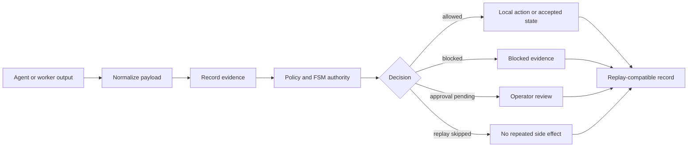
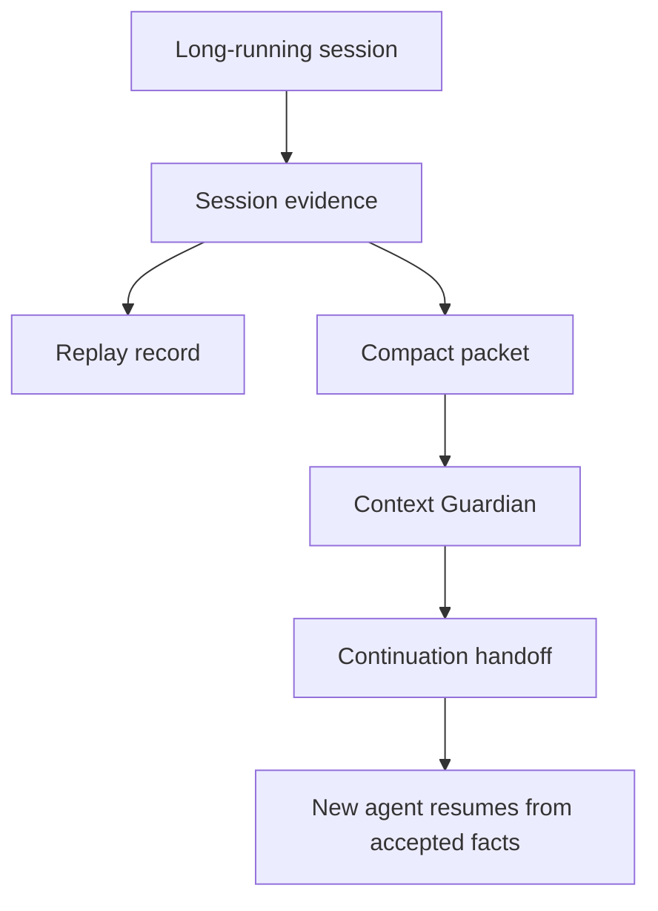

# Quant-M

<p align="center">
  
</p>

<p align="center">
  <strong>Local-first Rust control plane and flight recorder for governed AI work.</strong>
</p>

<p align="center">
  <strong>Agents generate. Quant-M records, gates, replays, and continues.</strong>
</p>

<p align="center">
  Evidence · replay · FSM authority · side-effect gates · context continuity · safe local defaults
</p>

Quant-M turns messy agent work into a local, inspectable record: what happened, what evidence supported it, what was blocked, what it cost, and whether another model or session can safely continue.

Quant-M is not a chatbot, broker, hosted agent platform, or trading bot. It is the local governance layer around AI-assisted work.

> `v0.1.0-alpha`: public developer preview. CLI-first, local-first, intentionally conservative, and not a production trading system.

[Five-Minute Proof](#five-minute-proof) | [Local Alpha Edge Cluster](#local-alpha-edge-cluster) | [Safety](#safety-posture) | [Runtime Model](#runtime-model) | [Authority Snapshot](#authority-snapshot) | [Story](#origin-story) | [Release Notes](docs/release/v0.1.0-alpha.md)

## Local Alpha Edge Cluster

Quant-M Edge Cluster Local Alpha is an experimental local-lab core/child worker runtime. It is suitable for a trusted LAN or fresh-device lab test, not for public beta, production deployment, autonomous trading, or autonomous betting.

What this local alpha can demonstrate:

- core CLI and `quant-m-child`
- QR/link child pairing with manual approval
- heartbeat visibility and device telemetry
- explicit observe-only leases
- echo evidence and scalar compute evidence
- desk observation evidence
- playbook-bound local model handoff stubs
- shared-state update validation

What remains disabled:

- live trading and live betting
- broker, exchange, or sportsbook execution
- provider calls from children
- automatic proposal approval
- child canonical writes
- production remote orchestration

Build the core and tiny child locally:

```bash
cargo build --features core-full
cargo build --bin quant-m-child --profile release-child --no-default-features --features child-min
```

Start a local pairing flow from the core:

```bash
cargo run --features core-full -- device add tablet-01 --desk crypto --role stablecoin_peg_watcher --link --watch --no-server
```

On the child device, use the printed link or command from the core. After operator approval, keep the child observe-only and verify heartbeat/telemetry from the core:

```bash
cargo run --features core-full -- cluster nodes
cargo run --features core-full -- cluster report
```

Release-candidate docs:

- [Local Alpha Release Notes](docs/local-alpha-release-notes.md)
- [Known Limitations](docs/known-limitations.md)
- [Security Boundaries](docs/security-boundaries.md)
- [Feature Matrix](docs/release/local-alpha-feature-matrix.md)
- [Release Checklist](docs/release/local-alpha-checklist.md)

## What Quant-M Is

Quant-M is a local Rust runtime for making AI-assisted work more inspectable, replayable, and governable. It is built for workflows where agent output alone is not enough.

A model can suggest, a worker can propose, a tool can be detected, and a channel can deliver a message. None of those things automatically become authority. Quant-M separates proposal from permission.

It helps answer:

- What did the agent do?
- Where is the evidence?
- Was a side effect allowed, blocked, or skipped?
- Can this session be replayed safely?
- Can another model continue from accepted facts?
- What did this cost?
- Which FSMs are actually wired, partially wired, or only audited?

## How Quant-M Is Different

Most AI tools focus on making agents do more. Quant-M focuses on making agent work safer to inspect, stop, replay, and continue.

| Compared with | Difference |
| --- | --- |
| ChatGPT or Claude | Chat tools answer questions. Quant-M records governed work, evidence, replay state, side-effect decisions, cost records, and continuation handoffs. |
| Codex, Claude Code, Gemini CLI, OpenCode | Coding agents generate and edit work. Quant-M gives them a local paper trail, policy boundary, replay path, and context continuation layer. |
| Agent harnesses | Harnesses coordinate tools and workers. Quant-M focuses on authority: evidence, proposals, allowed actions, blocked actions, replay, and safe continuation. |
| Trading bots | Quant-M came from a quant-risk cluster concept, but trading is not the alpha product. No live trading, broker execution, exchange execution, or auto-approval is enabled. |
| Logs | Logs tell you what happened. Quant-M aims to show what authority accepted, blocked, replayed, or continued. |

Use Quant-M when you want coding agents, worker agents, local models, or research workflows to leave behind evidence instead of terminal scrollback. Do not use it if you want a fully autonomous trading bot, a hosted SaaS agent platform, or unchecked tool execution.


## Five-Minute Proof

Clone the repo:

```bash
git clone https://github.com/web5labs/Quant-M.git
cd Quant-M
```

Run the local demo path:

```bash
./quantm demo
```

Or start Quant-M:

```bash
./quantm
```

On a project that has not completed onboarding, `./quantm` starts the full first-run questionnaire. After onboarding is completed, `./quantm` opens the governed Quant-M chat cockpit so the user can communicate with the local evidence agent.

Inside the Quant-M chat cockpit, try:

```text
/help
/state
/cost
/ask what should I inspect first?
/quit
```

The classic text shell remains available:

```bash
./quantm shell
```

Inside `quant-m>`, try:

```text
demo
doctor
help
exit
```

For an inspect-first terminal cockpit, use the existing TUI chat mode:

```bash
./quantm tui chat --inspect
```

The same command works on macOS, Linux, and Termux once the repo is built. On Windows PowerShell, after building with Cargo, run:

```powershell
.\target\debug\quant-m.exe tui chat --inspect
```

This is chat-shaped evidence navigation, not an agent authority surface. It reads structured Quant-M truth through internal Rust paths and does not call providers, write worker proposals, or shell out to `quant-m`.

To chat through the Codex CLI from inside the shell, use `ask <question>` after Codex is installed and logged in:

```text
ask what should I inspect first?
```

For the direct proof loop:

```bash
./quantm consensus --dry-run "What should a new Quant-M user inspect first?"
```

Copy the printed `session_id`, then run:

```bash
./quantm replay <session_id>
./quantm compact <session_id>
./quantm context guard --json
./quantm cost summary
./quantm fsm authority
```

The first run is intentionally safe:

- no broker
- no live trading
- no hidden provider call
- no automatic shell execution
- no hosted service requirement
- no API key requirement

## Expected Result

After the proof loop, you should be able to inspect a session record, evidence index, replay result, compact continuation packet, Context Guardian output, cost summary, and FSM authority snapshot. The point is to show that Quant-M can preserve what happened, classify what was allowed, and prepare safer continuation state for the next session.

## Safety Posture

Quant-M is conservative on purpose:

- Workers propose; the governed core decides.
- Channels are not execution authority.
- Replay does not repeat side effects.
- Shell-backed skills are blocked unless config and policy allow them.
- Provider, network, Telegram, webhook, HTTP worker, and shell paths stay gated.
- Live trading, broker execution, exchange execution, and auto-approval are not enabled.
- Detection does not equal permission: a model, CLI, tool, or channel can be present without being allowed.

This release is useful for evaluating the governance model, not for delegating unchecked autonomy.

## What Quant-M Does Today

| Surface | What it means |
| --- | --- |
| Evidence trail | Preserves what happened and where proof lives |
| Replay | Re-checks a run without repeating side effects |
| Compact packets | Turns long sessions into small continuation artifacts |
| Context Guardian | Emits typed continuation state and recommended next action |
| Cost ledger | Shows dry-run and provider-path costs locally |
| Capability truth | Separates shipped, guarded, dry-run, mock, experimental, design-only, external-required, unavailable, and deprecated surfaces |
| Side-effect policy gate | Normalizes decisions like `allowed`, `blocked`, `approval_pending`, `denied`, `unavailable`, `dry_run_only`, and `replay_skipped` |
| Workflow cursor FSM | Keeps workflow progress ordered without pretending descriptor browsing is execution |

## Runtime Model

Markdown explains why. Rust decides state. Replay proves what happened.



Agent or worker output enters Quant-M as a proposal or evidence item. Quant-M normalizes the payload, records evidence, checks policy and FSM authority, then classifies the result as `allowed`, `blocked`, `approval_pending`, `denied`, `unavailable`, `dry_run_only`, or `replay_skipped`.

Accepted state can be replayed. Blocked actions remain visible. Pending actions wait for operator authority. Replay does not repeat side effects.

## Context Continuity

Long AI sessions degrade. Quant-M treats context continuity as a first-class runtime problem.



A long session can produce evidence, replay records, compact packets, Context Guardian output, and a continuation handoff. A future model or session can resume from accepted facts instead of re-reading a giant chat history or guessing what mattered.

## Authority Snapshot

The Rust authority registry is the source of truth:

```bash
./quantm fsm authority
./quantm fsm authority --json
./quantm capabilities
./quantm capabilities --json
```

Current alpha snapshot:

| FSM | Status |
| --- | --- |
| `worker_job` | `wired` |
| `skill_execution` | `wired` |
| `context_guardian` | `wired` |
| `workflow_cursor` | `partially_wired` |
| `policy_approval` | `partially_wired` |
| `session_replay` | `partially_wired` |
| `worker_proposal` | `partially_wired` |
| `provider_tool_onboarding` | `audited_only` |
| `question_consensus_strategist` | `audited_only` |
| `shared_state_lifecycle` | `audited_only` |

`partially_wired` and `audited_only` are honest labels. Quant-M should not claim universal runtime authority where a surface is still inspection-only, locally validated, or documented rather than fully enforced.

## Where Quant-M Fits

Quant-M sits beside the tools you already use. It does not need to replace your coding agent, local model, browser harness, terminal, or editor.

Use Codex CLI, OpenAI CLI, Claude Code, Gemini, OpenCode, Antigravity-style CLIs, OpenRouter, or local models for generation and review. Use Quant-M to preserve evidence, replay decisions, normalize payloads, track cost, gate side effects, and prepare safe continuation state.

In plain language:

- Agents do the work.
- Quant-M records the work.
- Policy gates risky actions.
- Replay checks the record.
- Context Guardian prepares the handoff.
- Rust authority decides what is real.

## Origin Story

<p align="center">
  
</p>

Quant-M has two namesakes. The water bear represents resilience in harsh environments: stale context, failed runs, drift, interrupted sessions, incomplete evidence, tool confusion, unsafe side effects, and handoffs between models.

The quant side represents disciplined decision systems. Quant-M began as a stress test for an AI-assisted quant-risk cluster: cheap edge devices as workers, a stronger Rust core coordinating them, and high-risk actions passing through evidence, policy, cost tracking, and finite state machines.

Trading is not the alpha product. It was the proving ground that forced Quant-M to care about evidence, replay, policy, cost, state, and operator authority.

Original benchmark desks:

| Benchmark desk | Why it stresses the runtime |
| --- | --- |
| Forex | Multi-session markets, macro timing, risk discipline |
| Stocks | Market hours, news noise, portfolio context |
| Crypto arbitrage | Fragmented APIs, fast state changes, execution risk |
| Bitcoin DCA | Long-running accumulation, cost and schedule tracking |
| Prediction-style markets | Ambiguous signals, sentiment, and operator review |

Those desks are not promises. They explain why Quant-M is strict: a runtime shaped by high-risk decision environments cannot treat chat text as authority, let workers silently execute, or replay side effects.

## Onboarding Preview

Run guided setup when you want to review or change first-run answers:

```bash
./quantm onboard
```

For a throwaway demo config that will not touch your local setup:

```bash
./quantm --config /tmp/quant-m-demo.toml onboard
```

The onboarding flow covers workspace, device type, network posture, model provider, local model availability, explicit CLI tool selection, operator channel, continuity guard, and final review.

When you say a local model is available, onboarding scans common Ollama and LM Studio model locations and lists detected model tags first. CLI choices include Codex CLI, OpenAI CLI, Gemini CLI, Claude/Anthropic CLIs, OpenCode, Antigravity-style CLIs, Ollama, and LM Studio. Detection does not grant execution permission.

<table>
  <tr>
    <td width="50%">
      
    </td>
    <td width="50%">
      
    </td>
  </tr>
  <tr>
    <td width="50%">
      
    </td>
    <td width="50%">
      
    </td>
  </tr>
  <tr>
    <td width="50%">
      
    </td>
    <td width="50%">
      
    </td>
  </tr>
</table>

For the fuller colored HTML version, open [`docs/onboarding-mockup.html`](docs/onboarding-mockup.html).

## Validation

Local release validation for `v0.1.0-alpha` passed:

```bash
cargo fmt --all -- --check
cargo test
cargo clippy --all-targets -- -D warnings
cargo build --release --quiet
python3 scripts/lint_project_onboarding.py --target .
cargo run --quiet -- fsm authority --json
```

The `v0.1.0-alpha` release tag points at:

```text
720d68b5883da485365259e5417e0bb3bf413ea2
```

## What Is Not Ready Yet

Status: **public developer preview / alpha**.

Still developing:

- packaged release binaries and installer scripts
- fresh Mac and Linux first-run verification from README only
- formal launchd/systemd autostart docs
- broader provider normalization
- worker federation
- distributed state
- shared-state lifecycle FSM

## Contributing

Contributions should preserve Quant-M's local-first boundary: no hidden provider calls, no implicit live execution, no channel-as-authority, no live trading, and no worker proposal auto-acceptance.

## License

MIT
